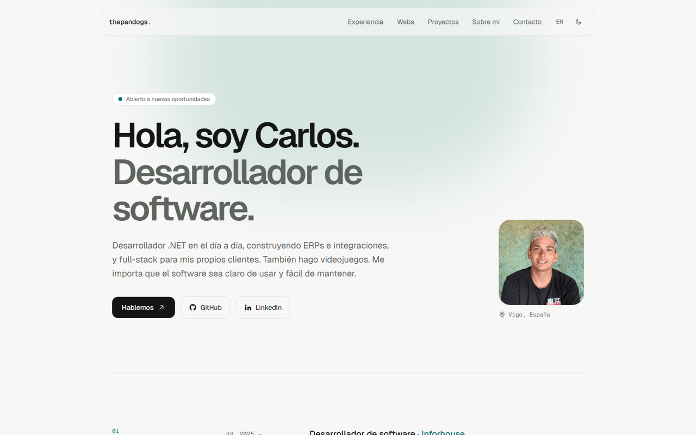

<div align="center">

# ThePandogs.dev

**Portfolio de Carlos Fraile — desarrollador de software en Vigo**

[**Ver la web →**](https://thepandogs.github.io/ThePandogs.dev/) · [English](https://thepandogs.github.io/ThePandogs.dev/en/) · [LinkedIn](https://linkedin.com/in/carlosfrailedev)

[](https://github.com/ThePandogs/ThePandogs.dev/actions/workflows/astro.yml)


<picture>
  <source media="(prefers-color-scheme: dark)" srcset="docs/preview-dark.png">
  
</picture>

</div>

## Qué incluye

- **Experiencia y formación** — puestos actuales y anteriores, con una etapa previa como técnico de sistemas.
- **Webs en producción** — Wayfare (Camino Galicia), Mundevo y Arenas de Alcabre, con captura, stack y enlace a la web. Su código es privado, así que no se enlaza.
- **Proyectos personales** — The Pandogs Games y una lista de proyectos públicos y privados.
- **Dos idiomas** — español en `/` e inglés en `/en/`, con `hreflang` y selector en la barra superior.
- **Modo claro y oscuro** — respeta la preferencia del sistema y recuerda la elección sin parpadeo al cargar.
- **Rendimiento** — HTML estático, imágenes optimizadas a WebP en varios tamaños y casi nada de JavaScript en el cliente.
- **SEO básico** — sitemap, `robots.txt`, URL canónica, Open Graph y página 404.

## Stack

| | |
|---|---|
| Framework | [Astro 7](https://astro.build) (salida estática) |
| Estilos | [Tailwind CSS 4](https://tailwindcss.com) vía `@tailwindcss/vite` |
| Tipografía | Geist y Geist Mono |
| Imágenes | `astro:assets` + sharp |
| Despliegue | GitHub Pages con GitHub Actions |
| Dependencias | Dependabot semanal con actualizaciones agrupadas |

## Estructura

```
src/
├── data/profile.ts     # Todo el contenido (perfil, experiencia, proyectos, stack) en es/en
├── i18n/index.ts       # Textos de la interfaz y utilidades de idioma
├── components/         # Secciones de la página (Hero, Experience, ClientWork, Projects…)
├── layouts/Base.astro  # <head>, metadatos, hreflang y tema
├── pages/              # index (es), en/index (en) y 404
├── assets/             # Foto y capturas que optimiza Astro
└── styles/global.css   # Tokens de color y tema de Tailwind
```

## Desarrollo

Requiere **Node.js 22.12+** y **pnpm**.

```bash
pnpm install
pnpm dev       # http://localhost:4321/ThePandogs.dev/
pnpm build     # astro check + build estático en dist/
pnpm preview   # sirve dist/ en local
```

## Editar el contenido

Todo el texto está en [`src/data/profile.ts`](src/data/profile.ts) y cada campo traducible tiene su versión `es` y `en`:

```ts
role: { es: "Desarrollador de software", en: "Software developer" },
```

- **Proyecto con captura:** añade la imagen a `src/assets/projects/` e impórtala en `profile.ts`.
- **Proyecto privado:** marca `private: true`; se muestra sin enlace y con la etiqueta «Código privado».
- **Texto de la interfaz** (menú, botones…): está en [`src/i18n/index.ts`](src/i18n/index.ts).

## Despliegue

Cada push a `main` construye la web y la publica en GitHub Pages:
**https://thepandogs.github.io/ThePandogs.dev/**

En los pull requests solo se ejecuta el build, para comprobar que compila antes de fusionar.

## Licencia

El código está bajo licencia [MIT](LICENSE). Los textos, la fotografía y las capturas son © Carlos Fraile y no forman parte de esa licencia.
